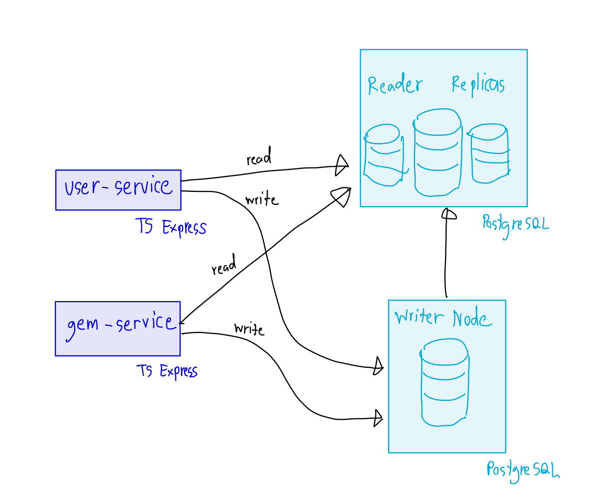

# Money Core Services

- [Completed Features](#completed-features)
- [Developing Features](#developing-features)
- [System Overview](#system-overview)
- [What Can Be Improved?](#what-can-be-improved)
- [Development Setup](#development-setup)
- [E2E Tests](#e2e-tests)

## Completed Features

- [x] Create new user with initial 1000 GEM (for convinence testing)
- [x] Users able to transfer their GEM with double-entry book keeping methodology
- [x] Users able to view their GEM account and balance
- [x] Users able to view their transactions with pagination
- [x] Logger with JSON structure on production environment (simple colorized for local development)
- [x] E2E tests

## Developing Features

- Requests validation and returning appropriate status code rather than always 500.
- Authentication: clients will need to obtained access token before using the restricted API, currently we use `user-id` as the request header to identify who is making the request.

## System Overview




## What Can Be Improved?

- Database Partitioning for table `gem_transactions` to improve read performance because we are expecting a huge amount of transactions in the future.
- Uses message queue to do non-critical operations which is not required strong consistency like transaction notification for example.
- Uses Prometheus for monitoring system health and Loki for storing logs, use Grafana as UI.

## Development Setup

**Prerequisite**

- Docker
- Nodejs

By the end of this guide, you are expecting to see services running on your local machine with PostgreSQL database running on your Docker container.

1. Create your own `.env` file

   ```sh
   cp .env.example .env
   ```

2. Install dependencies

   ```sh
   npm install
   ```

3. Start services' dependencies. Currently we have only PostgreSQL

   ```sh
   npm run db:up
   ```

4. Migrate schema so that your schema is up to date

   ```sh
   npm run schema:up
   ```

   If you want to migrate schema, please generate the `.sql` file using the following command

   ```sh
   npm run schema:gen
   ```

5. Start the desire service

   ```sh
   # run all services at the same time
   npm run dev

   # run only user-service
   npm run dev:user

   # run only gem-service
   npm run dev:gem
   ```

   Then you can explore the [API Endpoints](./docs/API.md). If you have no idea what to call first, we recommend you to run the [E2E Tests](#e2e-tests) to see the application flows

6. To drop the database and data

   ```sh
   npm run db:down-volumes
   ```

## E2E Tests

> Caveat: by following this guide, the data on your local database will be dropped. We can improve it later by split dev database and test database

To run E2E test on your local machine, you will need 2 terminal sessions. One is for the services and another one is for test script

1. Reset database and start services

   ```sh
   npm run dev-with-reset
   ```

2. Run E2E script

   ```sh
   npm run e2e
   ```

**LIMITATION**: the test can only be run once, we can improve it later by shipping all tests and its dependency into the docker compose, run it and destroy it after finish.
