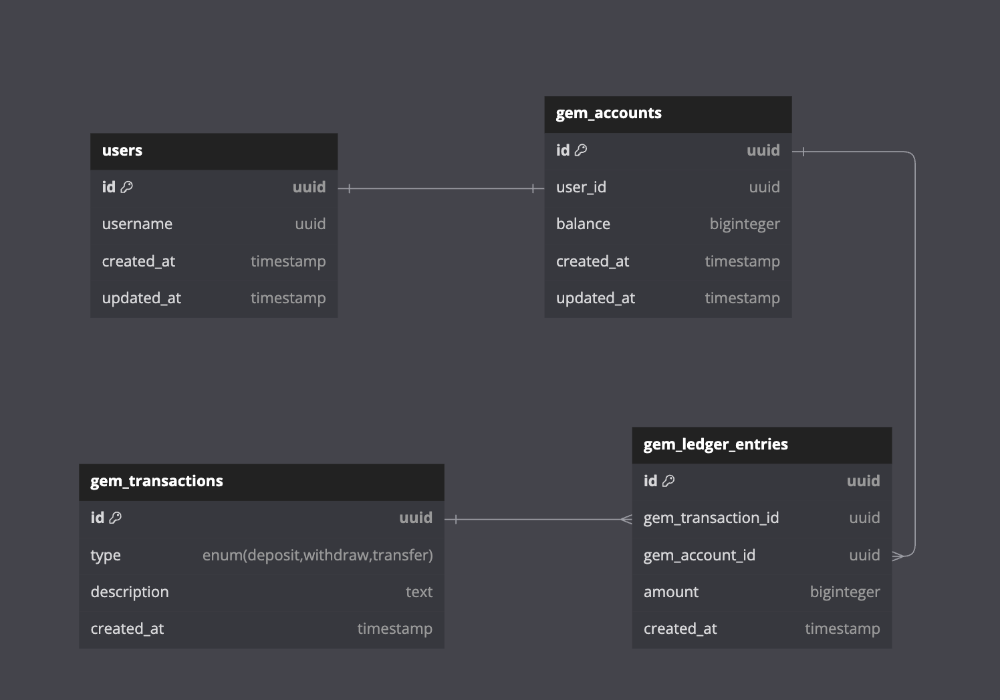

# Money Core Services

Core economy system for the XXX game!

## System Overview

[API Endpoints](./docs/API.md)



## Features

- [x] create user
- [x] /me
- [x] view gem account and balance
- [x] gem transfer with double-entry book keeping
- [x] get transactions with pagination
- [x] logger with JSON structure
- [ ] E2E tests

## Comming Soon

- [ ] validate request and appropriate status code
- [ ] autentication and middleware

## Development Setup

By the end of this guide, you are expecting to see services running on your local machine with PostgreSQL database running on your Docker container.

**Prerequisite**

- Docker
- Nodejs

1. Create your own `.env` file

```sh
cp .env.example .env
```

2. Start services' dependencies. Currently we have only PostgreSQL

```sh
docker compose -f docker-compose-db.yaml up -d
```

3. Migrate schema so that your schema is up to date

```sh
npm run schema:up
```

If you want to migrate schema, please generate the `.sql` file using the following command

```sh
npm run schema:gen
```

4. Start the desire service

```sh
# for user-service
npm run dev:user

# for gem-service
npm run dev:gem
```

5. To drop the database and data

```sh
docker compose -f docker-compose-db.yaml down --volumes
```
